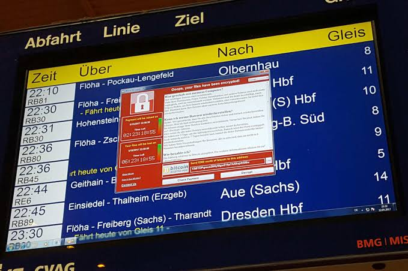

# WannaCry
This file contains the active ransomware, WannaCry I am not responsible for damage to any software that the executable may cause Only use this for testing purposes in a secure VM

 
<h3>WannaCry, WannaCrypt, WanaCrypt0r 2.0, Wanna Decryptor, a ransomware virus that targets Microsoft Windows. In May 2017, it launched a wide-ranging cyber attack infecting 230,000 computers in 99 countries, demanding ransoms in 28 languages.</h3>
<h4>Source: Wikipedia</h4>
<h1>WannaKiwi</h1>

How WannaKiwi works:
https://blog.comae.io/wannacry-decrypting-files-with-wanakiwi-demo-86bafb81112d
